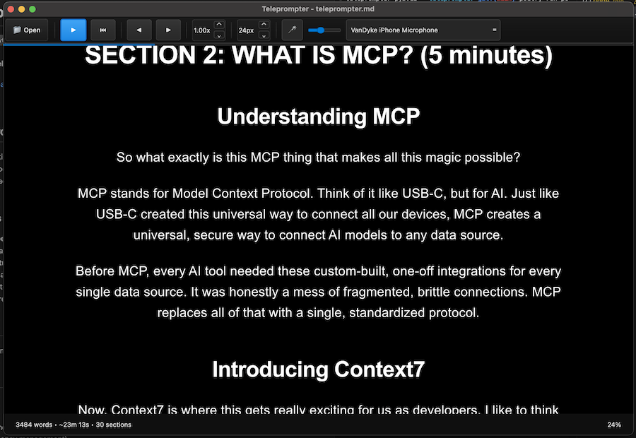
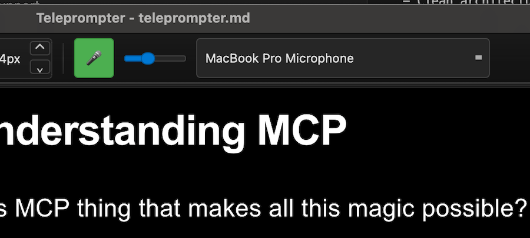

# 🐦 CueBird Teleprompter

<div align="center">


[](https://python-poetry.org/)


**A teleprompter application with voice control start/stop**

[Features](#-features) • [Demo](#-demo) • [Installation](#-installation) • [Downloads](#-downloads) • [Usage](#-usage) • [Architecture](#-architecture) • [Contributing](#-contributing)



</div>

## 🎬 What is CueBird Teleprompter?

CueBird Teleprompter is a sophisticated yet user-friendly teleprompter application designed for content creators, presenters, and video producers who need to deliver scripted content smoothly. Built with modern Python and PyQt6, it features voice-activated control, smooth 60 FPS scrolling, and a clean Domain-Driven Design architecture.

### ✨ Who is this for?
- Content Creators
- YouTubers
- Social Media Influencers

### ✨ Why Choose CueBird Teleprompter?

- **🎤 Hands-Free Operation**: Advanced voice activity detection automatically starts/stops scrolling
- **🚀 Blazing Fast**: Hardware-accelerated 60 FPS scrolling for professional results
- **🏗️ Clean Architecture**: Built with DDD principles for maintainability and extensibility
- **📱 Responsive**: Adapts seamlessly to any screen size
- **🔄 Live Reload**: Automatically updates when your script changes
- **🛡️ Reliable**: Comprehensive error handling and recovery

## 📸 Demo

<details>
<summary>Click to see CueBird Teleprompter in action</summary>

### Main Interface


### Voice Control Panel

</details>

## 🚀 Quick Start

### Prerequisites

- Python 3.13 or higher
- Poetry (for dependency management)
- Working microphone (for voice control)

### Installation

```bash
# Clone the repository
git clone https://github.com/mvdmakesthings/cuebird-teleprompter.git
cd cuebird

# Install dependencies
poetry install

# Run the application
poetry run poe run
```

That's it! CueBird will launch and you can start using it immediately.

## 📦 Downloads

### Pre-built Installers

For users who prefer not to build from source, pre-built installers are available:

| Platform | Download | Requirements |
|----------|----------|--------------|
| **macOS** | [Latest Release](https://github.com/mvdmakesthings/teleprompter/releases/latest) | macOS 10.13+ |
| **Windows** | [Latest Release](https://github.com/mvdmakesthings/teleprompter/releases/latest) | Windows 10+ (64-bit) |

#### Installation Instructions

**macOS:**
1. Download the `.dmg` file
2. Open the DMG and drag CueBird to your Applications folder
3. Right-click and select "Open" on first launch (security warning bypass)
4. Grant microphone access when prompted

**Windows:**
1. Download either the installer (`.exe`) or portable (`.zip`) version
2. For installer: Run the setup and follow the wizard
3. For portable: Extract the ZIP and run `CueBird.exe`
4. Allow through Windows Defender if prompted
5. Grant microphone access in Windows Settings if needed

## 📖 Features

### Core Functionality

| Feature | Description |
|---------|-------------|
| **📄 Markdown Support** | Full markdown rendering with custom styling |
| **⚡ Variable Speed** | Precise control from 0.05x to 5x |
| **🔤 Dynamic Font** | Adjustable text size from 16px to 120px |
| **📊 Reading Stats** | Word count, time estimates, progress tracking |
| **📑 Section Navigation** | Jump between headers with Previous/Next |
| **🖱️ Manual Override** | Mouse wheel control with auto-pause |
| **⌨️ Keyboard Shortcuts** | Comprehensive keyboard control |

### Advanced Features

#### 🎤 Voice Activity Detection
- WebRTC VAD for accurate speech detection
- Adjustable sensitivity (0.0-3.0)
- Multiple microphone support
- Visual status indicators
- Automatic start/stop based on speech

#### 🔄 File Watching
- Automatic reload on file changes
- Debounced updates
- Preserves scroll position

#### ⚙️ Configuration System
- JSON-based configuration
- Environment variable overrides
- Persistent preferences
- Type-safe validation

## 💻 Usage

### Basic Controls

| Action | Keyboard | Mouse/Button |
|--------|----------|--------------|
| Play/Pause | `Space` | ▶️ button |
| Reset | `R` | ⏮️ button |
| Speed Up | `↑` | Speed spinner |
| Speed Down | `↓` | Speed spinner |
| Previous Section | `←` | ⏮️ button |
| Next Section | `→` | ⏭️ button |
| Fullscreen | `F11` | 🖥️ button |
| Open File | `Ctrl+O` | 📁 button |

### Voice Control Setup

1. Click the 🎤 button to enable voice detection
2. Select your microphone from the dropdown
3. Adjust sensitivity slider as needed
4. Start speaking - the teleprompter will automatically scroll!

**Status Indicators:**
- 🔘 Gray: Disabled
- 🟠 Orange: Listening
- 🟢 Green: Speech detected
- 🔴 Red: Error

### Configuration

Create a `config.json` in your app directory:

```json
{
  "scroll_speed": 1.0,
  "font_size": 24,
  "voice_sensitivity": 1.0,
  "auto_hide_cursor": true,
  "file_watch_enabled": true
}
```

Or use environment variables:
```bash
export TELEPROMPTER_SCROLL_SPEED=1.5
export TELEPROMPTER_FONT_SIZE=32
```

## 🏗️ Architecture

The project follows **Domain-Driven Design** principles:

```
src/teleprompter/
├── core/              # Business logic & contracts
│   ├── protocols.py   # Interface definitions
│   ├── container.py   # Dependency injection
│   └── services.py    # Business services
├── domain/            # Domain models
│   ├── content/       # Content management
│   ├── reading/       # Reading control
│   └── voice/         # Voice detection
├── infrastructure/    # External services
└── ui/               # User interface
    ├── widgets/      # UI components
    └── managers/     # UI state management
```

### Key Design Patterns

- **Dependency Injection** - Centralized service container
- **Protocol-Oriented** - Interface-based design
- **Repository Pattern** - Data access abstraction
- **Observer Pattern** - Event-driven communication

## 🧪 Development

### Running Tests

```bash
# Run all tests
poetry poe test

# Run with coverage
poetry poe test-coverage

# Run specific test
poetry run pytest tests/test_file_manager.py
```

### Code Quality

```bash
# Format code
poetry poe format

# Run linter
poetry poe lint

# Run both
poetry poe check
```

### Available Tasks

```bash
poetry poe --help  # List all tasks
```

## 🤝 Contributing

We love contributions! Please see our [Contributing Guidelines](CONTRIBUTING.md) for details.

### Quick Guide

1. Fork the repository
2. Create your feature branch (`git checkout -b feature/amazing-feature`)
3. Make your changes
4. Run tests (`poetry poe test`)
5. Commit (`git commit -m 'Add amazing feature'`)
6. Push (`git push origin feature/amazing-feature`)
7. Open a Pull Request

## 📋 Roadmap

- [ ] Multiple script queue management
- [ ] Custom themes and color schemes
- [ ] Export to video overlay
- [ ] Remote control via mobile app
- [ ] Cloud synchronization
- [ ] Plugin system

## 📝 License

This project is dual-licensed:

- **Open Source**: GPL v3 License - see the [LICENSE](LICENSE) file for details
- **Commercial**: A commercial license is available for proprietary use

For commercial licensing inquiries, please submit a Github issue.

## 🙏 Acknowledgments

Built with these excellent open-source projects:

- [PyQt6](https://www.riverbankcomputing.com/software/pyqt/) - Qt bindings for Python
- [Python-Markdown](https://python-markdown.github.io/) - Markdown parsing
- [WebRTC VAD](https://github.com/wiseman/py-webrtcvad) - Voice detection
- [Poetry](https://python-poetry.org/) - Dependency management
- [Watchdog](https://github.com/gorakhargosh/watchdog) - File monitoring

## 💬 Support

- 🐛 [Report Issues](https://github.com/yourusername/teleprompter/issues)
- 💡 [Request Features](https://github.com/yourusername/teleprompter/issues/new?labels=enhancement)
- 📖 [Documentation](https://github.com/yourusername/teleprompter/wiki)
- 💬 [Discussions](https://github.com/yourusername/teleprompter/discussions)

---

<div align="center">
Made with ❤️ by the CueBird Teleprompter Team

<sub>If you find this project useful, please consider giving it a ⭐</sub>
</div>