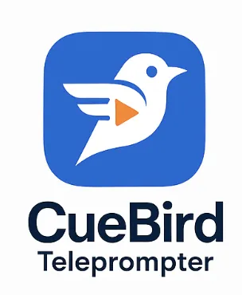
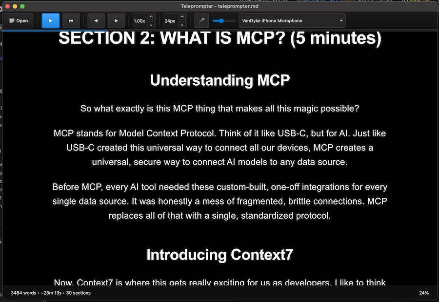
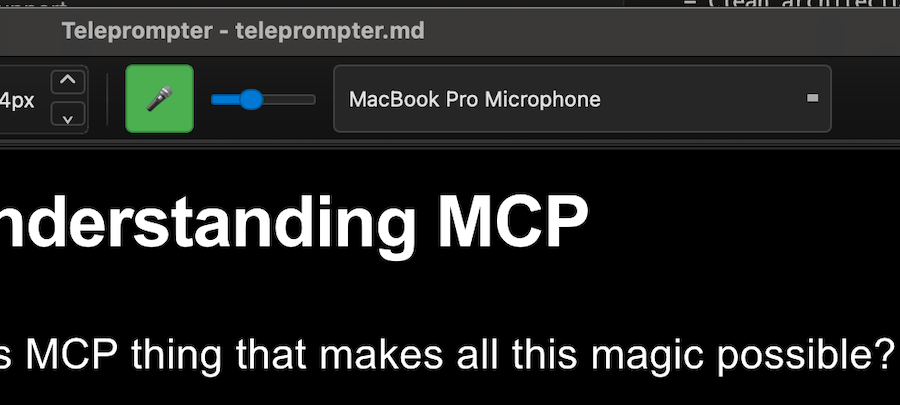

# 🐦 CueBird Teleprompter

<div align="center">




**A modern teleprompter application with voice control and real-time features**

[Features](#-features) • [Demo](#-demo) • [Installation](#-installation) • [Downloads](#-downloads) • [Usage](#-usage) • [Architecture](#-architecture) • [Contributing](#-contributing)



</div>

## 🎬 What is CueBird Teleprompter?

CueBird Teleprompter is a cutting-edge teleprompter application designed for content creators, presenters, and video producers. Built with modern web technologies (Electron + Next.js + FastAPI), it features voice-activated control, smooth 60 FPS scrolling, virtual scrolling for large texts, and real-time file watching. The application combines the power of a Python backend with a responsive React frontend for the ultimate teleprompter experience.

### ✨ Who is this for?
- Content Creators
- YouTubers
- Social Media Influencers

### ✨ Why Choose CueBird Teleprompter?

- **🎤 Hands-Free Operation**: Advanced voice activity detection with dual processing modes (frontend/backend)
- **🚀 Blazing Fast**: 60 FPS scrolling with virtual scrolling for texts over 10,000 words
- **🌐 Modern Stack**: Electron + Next.js + FastAPI for cross-platform compatibility
- **📱 Responsive UI**: Beautiful React-based interface that adapts to any screen
- **🔄 Real-Time Features**: WebSocket-powered file watching and voice control
- **⚡ Performance Optimized**: Adaptive performance profiles and real-time monitoring
- **🛡️ Production Ready**: Comprehensive error handling, reconnection logic, and graceful degradation

## 📸 Demo

<details>
<summary>Click to see CueBird Teleprompter in action</summary>

### Main Interface


### Voice Control Panel

</details>

## 🚀 Quick Start

### Prerequisites

- Node.js 20.x or higher
- Python 3.13 or higher
- npm or yarn
- Poetry (for Python dependencies)
- Working microphone (for voice control)

### Installation

```bash
# Clone the repository
git clone https://github.com/mvdmakesthings/cuebird-teleprompter.git
cd cuebird

# Install Python backend dependencies
poetry install

# Install Electron and frontend dependencies
cd teleprompter-electron
npm install

# Start the application in development mode
npm run dev
```

The application will launch with hot-reload enabled for both frontend and backend.

## 📦 Building & Packaging

### Development Mode

```bash
# Terminal 1: Start Python backend
cd src/teleprompter
poetry run python -m teleprompter.backend.main

# Terminal 2: Start Electron frontend
cd teleprompter-electron
npm run dev
```

### Production Build

```bash
# Build the Electron app for your platform
cd teleprompter-electron
npm run build        # Build for current platform
npm run build:mac    # Build for macOS
npm run build:win    # Build for Windows
npm run build:linux  # Build for Linux
```

### Pre-built Installers

Coming soon! Pre-built installers will be available for:
- **macOS**: Universal binary (Intel + Apple Silicon)
- **Windows**: 64-bit installer and portable versions
- **Linux**: AppImage, deb, and rpm packages

Check the [Releases](https://github.com/mvdmakesthings/teleprompter/releases) page for updates.

## 📖 Features

### Core Functionality

| Feature | Description |
|---------|-------------|
| **📄 Markdown Support** | Full markdown rendering with syntax highlighting |
| **⚡ Variable Speed** | Precise control from 0.05x to 5x with smooth transitions |
| **🔤 Dynamic Font** | Adjustable text size from 16px to 120px |
| **📊 Reading Metrics** | Real-time word count, elapsed/remaining time, WPM tracking |
| **📑 Section Navigation** | Smart navigation between markdown headers |
| **🖱️ Manual Control** | Mouse wheel scrolling with auto-pause |
| **⌨️ Keyboard Shortcuts** | Global and local shortcuts for all controls |
| **🎯 Virtual Scrolling** | Handles texts over 10,000 words smoothly |

### Advanced Features

#### 🎤 Voice Activity Detection
- **Dual Processing Modes**: Frontend (low latency) or Backend (high accuracy)
- **WebRTC VAD**: Industry-standard voice detection algorithm
- **Adjustable Sensitivity**: Fine-tune from 0.0 to 3.0
- **Multi-Device Support**: Select from available microphones
- **Real-time Visualization**: Audio level meters and status indicators
- **Auto-Control**: Start/stop scrolling based on speech with debouncing

#### 🔄 File Watching
- **Real-time Updates**: WebSocket-powered file change notifications
- **Smart Reloading**: Debounced updates to prevent excessive reloads
- **State Preservation**: Maintains scroll position and playback state
- **User Control**: Enable/disable and configure reload behavior
- **Error Handling**: Graceful handling of file deletion/permission issues

#### ⚡ Performance Features
- **Virtual Scrolling**: Efficient rendering for large documents
- **Adaptive Performance**: Automatic performance profile selection
- **Real-time Monitoring**: FPS counter and performance metrics
- **Request Optimization**: Debouncing and caching for API calls
- **Memoized Components**: React optimization for smooth UI

#### 🔧 Configuration System
- **Multi-layer Config**: JSON files + environment variables
- **Type-safe Validation**: Pydantic models for all settings
- **Persistent Storage**: User preferences saved between sessions
- **Hot Reload**: Changes apply without restart
- **Cross-platform**: Works on Windows, macOS, and Linux

## 💻 Usage

### Basic Controls

| Action | Keyboard | Global Shortcut | UI Control |
|--------|----------|-----------------|------------|
| Play/Pause | `Space` | `Cmd/Ctrl+Space` | Play button |
| Reset Position | `R` | `Cmd/Ctrl+R` | Reset button |
| Speed Up | `↑` or `+` | - | Speed slider |
| Speed Down | `↓` or `-` | - | Speed slider |
| Previous Section | `←` | - | Previous button |
| Next Section | `→` | - | Next button |
| Toggle Voice | `V` | - | Voice button |
| Toggle Cursor | `C` | - | Settings menu |
| Exit/Stop | `Escape` | - | - |
| Show Help | - | - | Keyboard icon |

### Voice Control Setup

1. Click the microphone button in the control panel
2. Grant microphone permissions when prompted
3. Select your preferred microphone from the dropdown
4. Choose processing mode:
   - **Frontend**: Lower latency, browser-based processing
   - **Backend**: Higher accuracy, server-side processing
5. Adjust sensitivity (0.0 - 3.0, default: 1.0)
6. Start speaking - the teleprompter will automatically scroll!

**Visual Indicators:**
- **Gray**: Voice control disabled
- **Orange**: Listening for voice activity
- **Green**: Voice detected, scrolling active
- **Red**: Error or permission denied
- **Audio Meter**: Real-time voice level visualization

### Configuration

#### Frontend Settings (Stored in browser)
- Scroll speed, font size, and UI preferences
- Voice control settings and processing mode
- File watching preferences
- Performance profile selection

#### Backend Configuration

Create a `config.json` in your backend directory:

```json
{
  "api": {
    "host": "127.0.0.1",
    "port": 8123,
    "cors_origins": ["http://localhost:3000"]
  },
  "voice": {
    "sample_rate": 16000,
    "vad_mode": 3,
    "frame_duration": 30
  },
  "file_watch": {
    "enabled": true,
    "debounce_seconds": 0.5
  }
}
```

Or use environment variables:
```bash
export TELEPROMPTER_API_PORT=8123
export TELEPROMPTER_VOICE_VAD_MODE=3
export TELEPROMPTER_FILE_WATCH_ENABLED=true
```

## 🏗️ Architecture

CueBird uses a modern three-tier architecture:

### Frontend (Electron + Next.js)
```
teleprompter-electron/
├── apps/
│   ├── desktop/          # Electron main process
│   │   ├── main/         # Window management, IPC
│   │   └── preload/      # Secure bridge to renderer
│   ├── frontend/         # Next.js React app
│   │   ├── app/          # App router pages
│   │   ├── components/   # React components
│   │   ├── hooks/        # Custom React hooks
│   │   ├── store/        # Zustand state management
│   │   └── services/     # API and WebSocket clients
│   └── backend/          # Python backend reference
└── packages/             # Shared TypeScript types
```

### Backend (FastAPI + Python)
```
src/teleprompter/
├── backend/
│   ├── api/              # REST API endpoints
│   ├── websocket/        # Real-time communication
│   └── services/         # Backend adapters
├── core/                 # Business logic & contracts
│   ├── protocols.py      # Interface definitions
│   ├── container.py      # Dependency injection
│   └── services.py       # Business services
└── domain/               # Domain models
    ├── content/          # Content management
    ├── reading/          # Reading control
    └── voice/            # Voice detection
```

### Key Technologies

**Frontend Stack:**
- **Electron 32.x**: Desktop application framework
- **Next.js 14**: React framework with App Router
- **TypeScript 5.x**: Type-safe JavaScript
- **Zustand**: State management
- **Tailwind CSS**: Utility-first styling
- **Framer Motion**: Animations

**Backend Stack:**
- **FastAPI 0.115+**: Modern Python web framework
- **WebSockets**: Real-time communication
- **Pydantic**: Data validation
- **WebRTC VAD**: Voice activity detection
- **Watchdog**: File system monitoring

### Communication Flow
1. **Electron Main** ↔️ **Renderer** via IPC (Inter-Process Communication)
2. **React Frontend** ↔️ **Python Backend** via REST API and WebSocket
3. **Backend Services** use dependency injection for loose coupling

## 🧪 Development

### Backend Development

```bash
# Run Python tests
poetry poe test
poetry poe test-coverage

# Code quality
poetry poe lint      # Run ruff linter
poetry poe format    # Format with ruff
poetry poe check     # Run both lint and format

# Start backend server
poetry run python -m teleprompter.backend.main --reload
```

### Frontend Development

```bash
cd teleprompter-electron

# Run frontend tests
npm test

# Type checking
npm run type-check

# Linting
npm run lint

# Start development server
npm run dev

# Build for production
npm run build
```

### Project Scripts

**Backend (Poetry):**
- `poe run-backend` - Start FastAPI server
- `poe run-backend-dev` - Start with auto-reload
- `poe test` - Run pytest suite
- `poe lint` - Check code style
- `poe format` - Auto-format code

**Frontend (npm):**
- `npm run dev` - Start Electron + Next.js in dev mode
- `npm run build` - Build for current platform
- `npm run test` - Run frontend tests
- `npm run lint` - ESLint checking

## 🤝 Contributing

We love contributions! Please see our [Contributing Guidelines](CONTRIBUTING.md) for details.

### Quick Guide

1. Fork the repository
2. Create your feature branch (`git checkout -b feature/amazing-feature`)
3. Make your changes
4. Run tests (`poetry poe test`)
5. Commit (`git commit -m 'Add amazing feature'`)
6. Push (`git push origin feature/amazing-feature`)
7. Open a Pull Request

## 📋 Roadmap

### Version 2.0 (Current)
- [x] Electron + Next.js migration
- [x] Virtual scrolling for large texts
- [x] Dual voice processing modes
- [x] Real-time performance monitoring
- [x] WebSocket communication
- [x] File watching with notifications

### Version 2.1 (Planned)
- [ ] Multiple script queue management
- [ ] Custom themes and dark/light modes
- [ ] Bookmark system for scripts
- [ ] Export reading statistics
- [ ] Customizable keyboard shortcuts
- [ ] Multi-language UI support

### Version 3.0 (Future)
- [ ] Cloud synchronization
- [ ] Mobile companion app
- [ ] Team collaboration features
- [ ] AI-powered script analysis
- [ ] Video recording integration
- [ ] Plugin system for extensions

## 📝 License

This project is licensed under the MIT License - see the [LICENSE](LICENSE) file for details.

## 🙏 Acknowledgments

Built with these excellent open-source projects:

**Frontend:**
- [Electron](https://www.electronjs.org/) - Cross-platform desktop apps
- [Next.js](https://nextjs.org/) - React framework
- [Tailwind CSS](https://tailwindcss.com/) - Utility-first CSS
- [Zustand](https://github.com/pmndrs/zustand) - State management
- [Framer Motion](https://www.framer.com/motion/) - Animation library

**Backend:**
- [FastAPI](https://fastapi.tiangolo.com/) - Modern web framework
- [Python-Markdown](https://python-markdown.github.io/) - Markdown parsing
- [WebRTC VAD](https://github.com/wiseman/py-webrtcvad) - Voice detection
- [Poetry](https://python-poetry.org/) - Dependency management
- [Watchdog](https://github.com/gorakhargosh/watchdog) - File monitoring

## 💬 Support

- 🐛 [Report Issues](https://github.com/yourusername/teleprompter/issues)
- 💡 [Request Features](https://github.com/yourusername/teleprompter/issues/new?labels=enhancement)
- 📖 [Documentation](https://github.com/yourusername/teleprompter/wiki)
- 💬 [Discussions](https://github.com/yourusername/teleprompter/discussions)

---

<div align="center">
Made with ❤️ by the CueBird Teleprompter Team

<sub>If you find this project useful, please consider giving it a ⭐</sub>
</div>